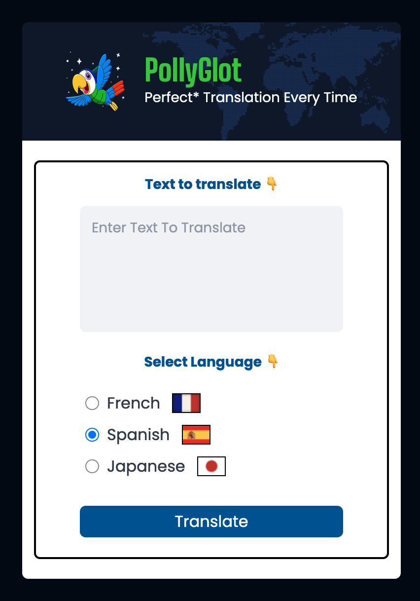
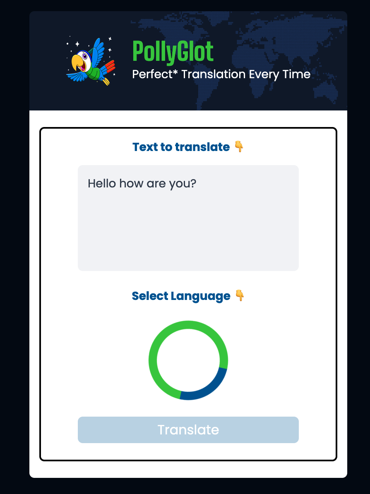
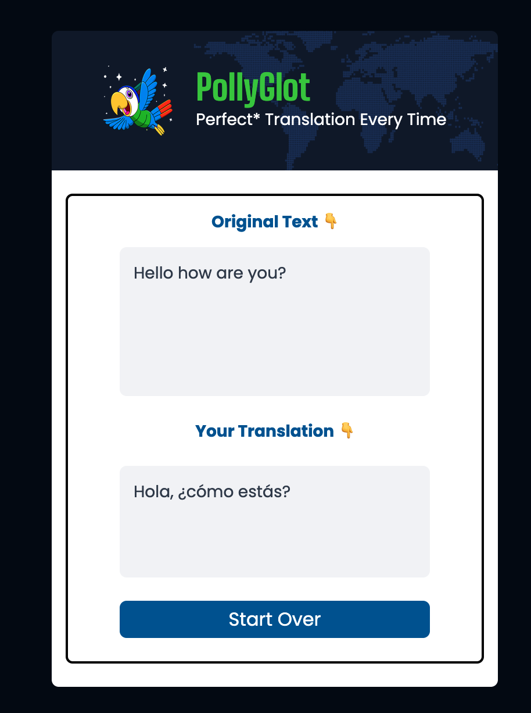

# AI powered translator (Scrimba Project)

This is a simple AI powered translator inspired by the [scrimba.com](https://scrimba.com) solo project. Input text (in english) and recieve back a 
translation from one of the language options.
<br>
<br>

## How it was made:

**Tech used:** 
- OpenAI API for AI translations
- Tailwind for styling
- Vite for building
- Vanilla HTML/CSS, and JS for everything else

## Visual Example


<br> Desktop landing page <br>


<br> Desktop loading page <br>


<br> Desktop result page <br>

## How To Run The Project

1. Download the files onto your local environment or copy this repo and navigate into the folder you downloaded them into
```
cd this-repo
```
2. Open in your preferred IDE and install dependencies
```
npm install
```
3. In your integrated terminal, call npm run dev
```
npm run dev
```
4. To run locally, make sure you have an OpenAI API key and follow the comments in index.js, set up client section
```
const client = new OpenAI({
    // for running ONLY local test, put your openAI API key here and set dangerouslyAllowBrowser to true
    apiKey: 'yourKeyHere',
    dangerouslyAllowBrowser: true // only use this if testing locally! This exposes your API key!

    // for deploying properly, use your .env to load your API key or load it from a backend
    // apiKey = process.env.OPENAI_API_KEY
});
```
5. Open in your browser and test it out! The current GPT model (5-nano) and setup should be pretty cheap so don't worry about wasting tokens


## Features:

Following the project guidelines, this project features...
1. Built from given project design
2. Setup OpenAI API
3. Selected models, engineered prompt, used temperature, and max_tokens
4. Rendered completion 

<hr>

## Reflection

Where to start, this was a really exciting project! Implementing AI into a project in real life really changed my perspective on this whole
process. This solo project was the conclusion of the 'Intro to AI Engineering' by Scrimba and I would say it nailed the title. I started this project
having never attempted integrating AI into projects and at the end I've fully integrated the OpenAI API into my project. There is still so much
to learn but we covered and implemented 1. using the OpenAI API (requests, models, tokens, messages, etc.) 2. beginner prompt-engineering 3. 
parameters 4. prototyping and 5. other smaller concepts (temperature, few shot, stop sequence, penalties, etc.)

Excited to move on to the next project and keep learning this AI engineer path. My code isn't always perfect, so any comments or criticism are welcome!